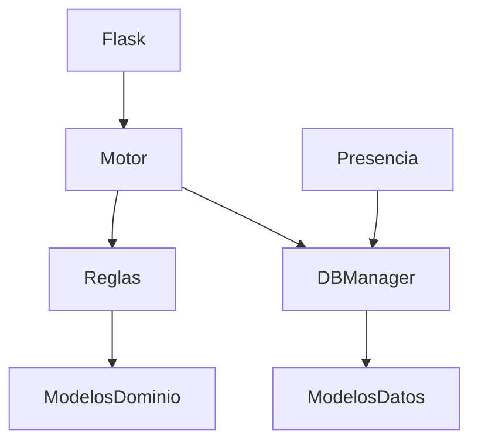

# Arquitectura del Sistema

El sistema sigue una arquitectura modular y testeable, basada en la separación clara entre:

- Capa de presentación (Flask)
- Capa de negocio (guardias)
- Capa de hardware (presencia)
- Capa de datos (SQLite + db_manager)

